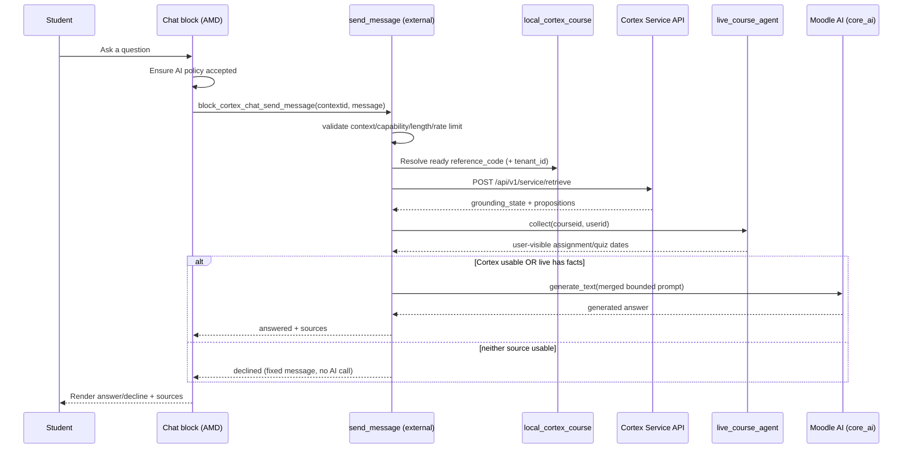

# Architecture

## Components

| Component | File | Responsibility |
| --- | --- | --- |
| Block | `block_cortex_chat.php` | Renders the chat shell or an unavailable state; bootstraps the AMD module. |
| Config | `classes/local/config.php` | Typed accessors for block settings; reuses `local_cortex` tenant id. |
| Service client | `classes/local/service_client.php` | Server-side HTTP client for the Cortex Service Plane `retrieve` endpoint. |
| Live course agent | `classes/local/live_course_agent.php` | In-process, read-only Moodle query returning the asking user's effective assignment/quiz schedule as propositions. |
| Chat service | `classes/local/chat_service.php` | Orchestrates availability, gathers Cortex + live evidence, the fail-closed gate, prompt building, and Moodle AI generation. |
| Rate limiter | `classes/local/rate_limiter.php` | Sliding-window per-user request cap backed by a MUC cache. |
| External function | `classes/external/send_message.php` | AJAX entry point: validation, capability, rate limit, then `chat_service::ask()`. |
| UI | `amd/src/chat.js`, `templates/*.mustache`, `styles.css` | Accessible chat widget, message rendering, policy prompt, error/decline states. |
| Privacy | `classes/privacy/provider.php` | Declares external transmission (Cortex) and the `core_ai` subsystem link. |

## Multi-source pipeline

The pipeline separates evidence gathering from generation so each stage is
independently observable and enforced. Two evidence sources are merged before
generation: Cortex retrieval (conceptual course content) and the live course
agent (the asking user's authoritative activity schedule).



## Why not `/chat/completions`?

Cortex's OpenAI-compatible `POST /api/v1/service/chat/completions` both retrieves
and generates **inside** Cortex. The requirement is to pass the retrieved context
to the **Moodle AI subsystem** for formatting. Therefore the block calls the
`retrieve` endpoint and then Moodle AI `generate_text`, keeping generation under
Moodle's provider configuration, failover, rate limits, and auditing.

## Course scoping and fail-closed policy

- `tenant_id` comes from `local_cortex` site config; `reference_code` comes from
  the course's `local_cortex_course` row. **Neither is accepted from the client**,
  so a user cannot redirect a query to another course's corpus.
- `chat_service::should_decline()` is the Cortex-side gate: only `strong` or
  `qualified` grounding **with** at least one proposition counts as usable
  course-content evidence.
- The overall gate is multi-source and still fail-closed: generation proceeds
  only if Cortex is usable **or** the live agent returned at least one
  user-visible fact. If neither has evidence the fixed decline message is
  returned and the AI provider is never called. When Cortex grounding is weak,
  its rejected propositions are dropped and the answer is composed from the live
  schedule alone. If Cortex is unavailable (transport error / non-200) and there
  is no live evidence, a retryable error is returned instead of a decline.
- Availability is re-checked server-side inside `ask()`; the browser check is
  advisory only.

## Live course agent

`live_course_agent::collect($courseid, $userid)` is an in-process, read-only
Moodle query. It runs as the asking user and returns their effective activity
schedule as propositions that share the shape used by Cortex retrieval, so the
prompt builder and citation code are shared.

- **Scope (MVP):** `assign` and `quiz` only. For each visible activity it emits:
  - an existence/gradedness summary (activity type, name, and whether it is a
    graded activity with its maximum grade) so questions like "does this course
    have an exam?" work even when no dates are set;
  - the labelled dates from `\core\activity_dates::get_dates_for_module()`
    (assignment open/due; quiz open/due/close) when present. Those APIs return
    the user's effective dates, including their user/group overrides, which the
    modules apply to the current session user in `mod_assign_cm_info_dynamic` /
    `mod_quiz_cm_info_dynamic`.

  Gradedness is read from the activity's grade item (course configuration), not
  from any learner's grade.
- **Visibility:** only modules with `cm_info::$uservisible` are included, so
  hidden or restricted activities never leak.
- **Privacy:** no grades, gradebook history, completion, submissions, or any
  other learner's data are read. Output stays in the local Moodle AI prompt and
  is never written to the Cortex corpus.
- **Bounds:** at most `maxliveactivities` activities are reported; failures are
  swallowed so live data can never break the chat.
- **Toggle:** disabled when `livedataenabled` is off, restoring RAG-only chat.

## Prompt construction

`chat_service::build_prompt($message, $cortexprops, $liveprops)` produces a
single numbered context merging both sources so citations map to one source
list regardless of origin:

- a `LIVE COURSE SCHEDULE:` section first (authoritative per-user dates),
  rendered ahead of course material so it is protected by the character budget;
- a `COURSE MATERIAL:` section (Cortex propositions) up to `maxpropositions`;
- both bounded by the shared `maxcontextchars` budget with continuous numbering
  (`[1] … (source: …)`);
- an ordered, de-duplicated list of source references for citation output;
- a deterministic instruction block: answer only from the supplied information,
  prefer the live schedule for any date/deadline question, do not use general
  knowledge, and cite the numbered sources. Empty sections are omitted.

Cortex's retrieval gate plus the live agent's visibility checks are the primary
enforcement of scope; the prompt policy is defense in depth.

## Moodle AI integration

Generation uses:

```php
$action = new \core_ai\aiactions\generate_text($contextid, $userid, $prompt);
$response = \core\di::get(\core_ai\manager::class)->process_action($action);
```

Availability follows the pattern used by `aiplacement_courseassist`:
`manager::is_action_available(generate_text::class)` and
`manager::is_action_enabled_in_context($context, generate_text::class)`. Policy
acceptance uses `manager::get_user_policy_status()` (server) and the
`core_ai/policy` AMD module (client).

## Output safety

The AMD module renders message text through the `message` Mustache template
(`{{message}}`, auto-escaped) and via `textContent` for status/error nodes. Model
output is never injected as raw HTML.
