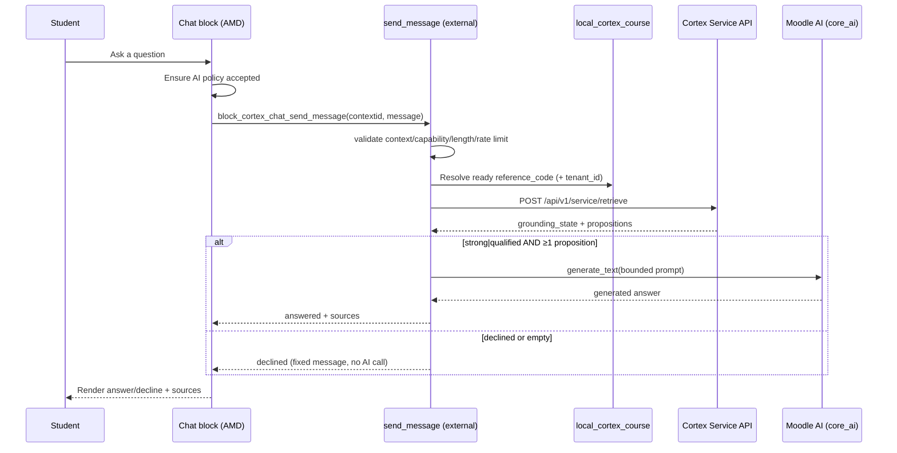

# Architecture

## Components

| Component | File | Responsibility |
| --- | --- | --- |
| Block | `block_cortex_chat.php` | Renders the chat shell or an unavailable state; bootstraps the AMD module. |
| Config | `classes/local/config.php` | Typed accessors for block settings; reuses `local_cortex` tenant id. |
| Service client | `classes/local/service_client.php` | Server-side HTTP client for the Cortex Service Plane `retrieve` endpoint. |
| Chat service | `classes/local/chat_service.php` | Orchestrates availability, the fail-closed gate, prompt building, and Moodle AI generation. |
| Rate limiter | `classes/local/rate_limiter.php` | Sliding-window per-user request cap backed by a MUC cache. |
| External function | `classes/external/send_message.php` | AJAX entry point: validation, capability, rate limit, then `chat_service::ask()`. |
| UI | `amd/src/chat.js`, `templates/*.mustache`, `styles.css` | Accessible chat widget, message rendering, policy prompt, error/decline states. |
| Privacy | `classes/privacy/provider.php` | Declares external transmission (Cortex) and the `core_ai` subsystem link. |

## Two-stage pipeline

The requested pipeline separates retrieval from generation so each stage is
independently observable and enforced:



## Why not `/chat/completions`?

Cortex's OpenAI-compatible `POST /api/v1/service/chat/completions` both retrieves
and generates **inside** Cortex. The requirement is to pass the retrieved context
to the **Moodle AI subsystem** for formatting. Therefore the block calls the
`retrieve` endpoint and then Moodle AI `generate_text`, keeping generation under
Moodle's provider configuration, failover, rate limits, and auditing.

## Course scoping and fail-closed policy

- `tenant_id` comes from `local_cortex` site config; `reference_code` comes from
  the course's `local_cortex_course` row. **Neither is accepted from the client**,
  so a user cannot redirect a query to another course's corpus.
- `chat_service::should_decline()` is the single fail-closed gate: only `strong`
  or `qualified` grounding **with** at least one proposition proceeds to AI
  generation. Everything else returns the fixed decline message and never calls
  the AI provider.
- Availability is re-checked server-side inside `ask()`; the browser check is
  advisory only.

## Prompt construction

`chat_service::build_prompt()` produces:

- numbered propositions (`[1] … (source: …)`) up to `maxpropositions`, subject to
  a total `maxcontextchars` budget;
- an ordered, de-duplicated list of source references for citation output;
- a deterministic instruction block: answer only from the supplied material, do
  not use general knowledge, state uncertainty rather than infer, and cite the
  numbered sources.

Cortex's retrieval gate is the primary enforcement of "course material only";
the prompt policy is defense in depth.

## Moodle AI integration

Generation uses:

```php
$action = new \core_ai\aiactions\generate_text($contextid, $userid, $prompt);
$response = \core\di::get(\core_ai\manager::class)->process_action($action);
```

Availability follows the pattern used by `aiplacement_courseassist`:
`manager::is_action_available(generate_text::class)` and
`manager::is_action_enabled_in_context($context, generate_text::class)`. Policy
acceptance uses `manager::get_user_policy_status()` (server) and the
`core_ai/policy` AMD module (client).

## Output safety

The AMD module renders message text through the `message` Mustache template
(`{{message}}`, auto-escaped) and via `textContent` for status/error nodes. Model
output is never injected as raw HTML.
